# imajin — figure gallery

Every figure type imajin currently produces, rendered at **default styling on synthetic
data** — a reference for the plotting tools' look, colour palette and options. An
interactive version is [`index.html`](index.html) (open it in a browser).

---

## Palette & typography

Control is a de-emphasised slate grey (`#636867`); conditions get colour — colorblind-safe
(min ΔE ≥ 15.2). Fonts: **Noto Sans** (default) / **Noto Serif**. Axis, tick and legend
labels are auto-formatted to scientific typography (`Mean Intensity`, `µm²`, `(A.U.)`).

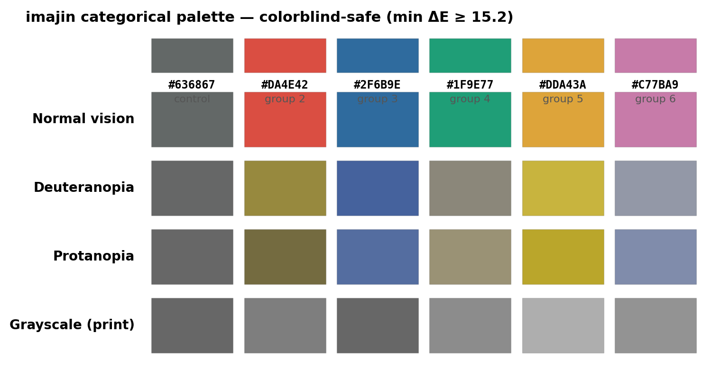 
6-colour categorical palette — verified under normal / deuteranopia / protanopia / grayscale.

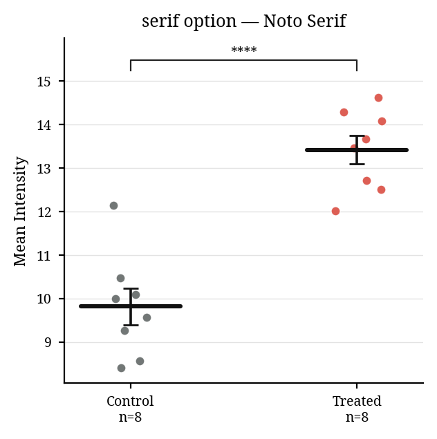 
<code>font="serif"</code> — Noto Serif option (default is Noto Sans).

## Group comparison — `plot_group_distribution`

Chart `kind`, paired lines, post-hoc brackets and the condition matrix are all options of
one tool.

<table>
<tr>
<td align="center">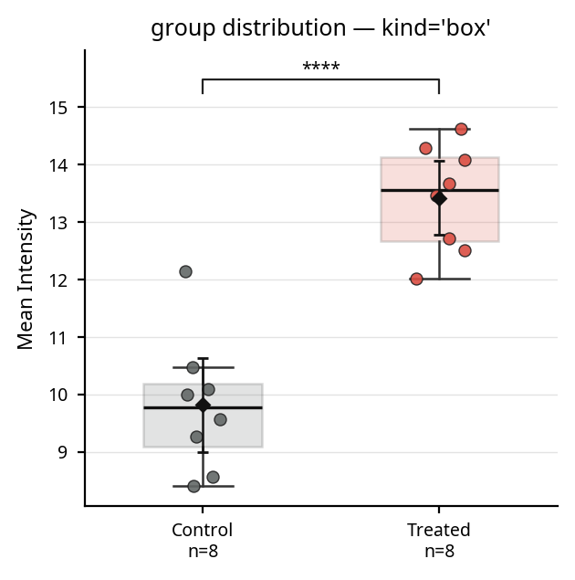 <code>kind="box"</code> — box + points + mean ± 95% CI (default)</td>
<td align="center">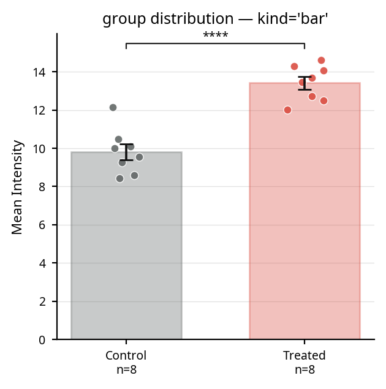 <code>kind="bar"</code> — mean + SEM bars + points</td>
</tr>
<tr>
<td align="center">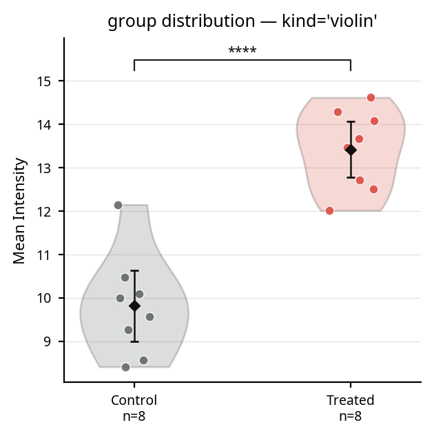 <code>kind="violin"</code> — density + points</td>
<td align="center">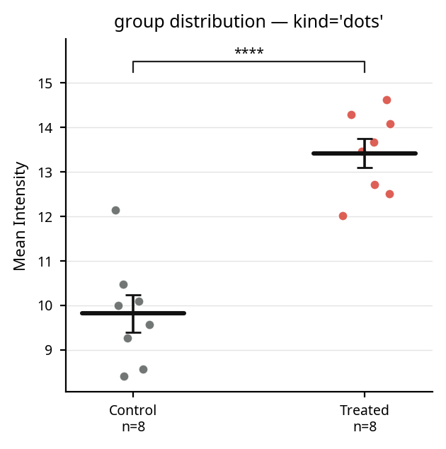 <code>kind="dots"</code> — all points + mean ± SEM (best for small n)</td>
</tr>
<tr>
<td align="center">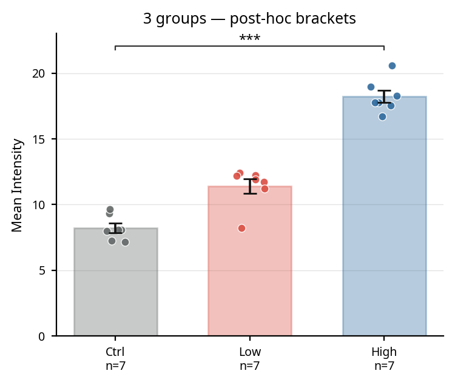 3 groups — multiplicity-corrected post-hoc brackets</td>
<td align="center">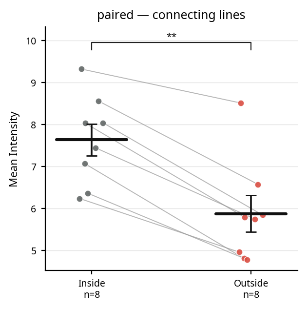 <code>paired=True</code> — within-subject connecting lines</td>
</tr>
</table>

## Condition matrix — `condition_matrix=`

Filled ● (positive) / open ○ (negative) circles per factor beneath the bars — replaces
long compound tick labels; reusable across plots.

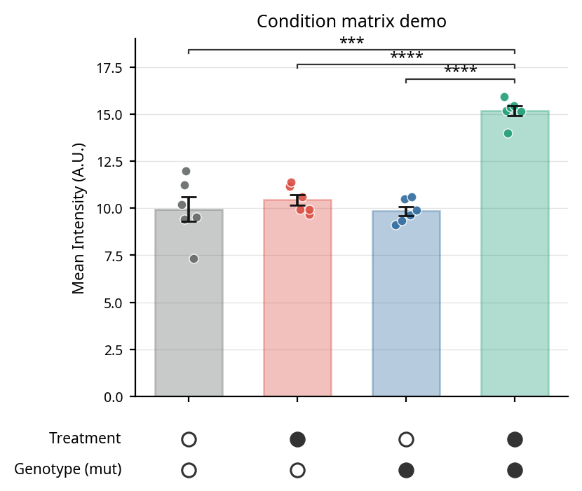 
<code>plot_group_distribution</code> — Treatment / Genotype condition table (columns = bars).

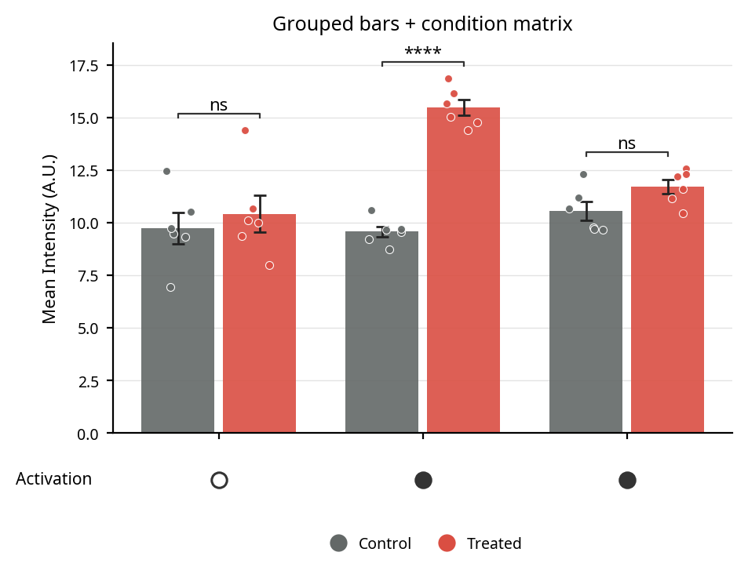 
<code>plot_grouped_bars</code> — grouped bars + condition table (Activation) + circle legend + per-condition significance.

## Time series — `plot_timecourse`

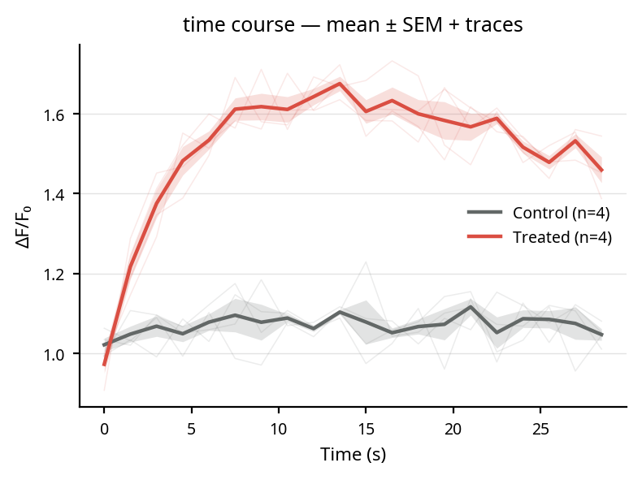 
Group mean ± SEM band over individual traces.

## Correlation — `plot_scatter`

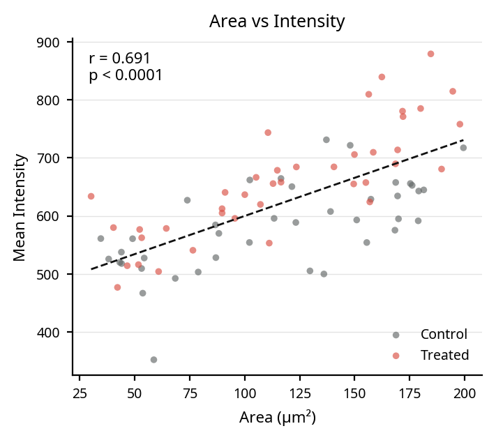 
Grouped colour + regression line + <code>r</code> / <code>p</code>.

## Calcium imaging — `plot_dff_heatmap`

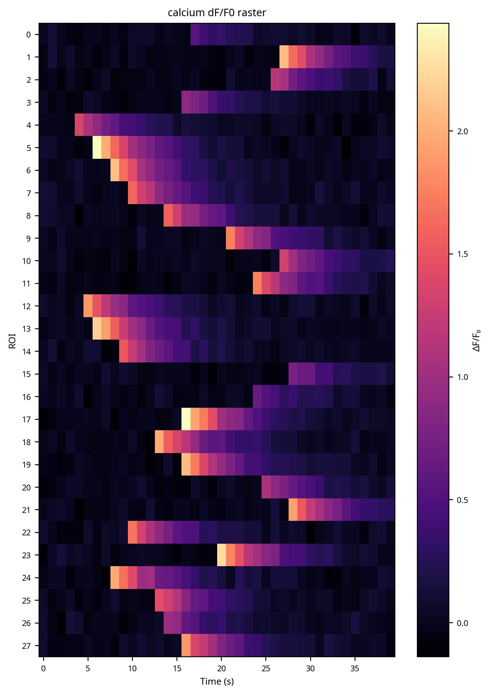 
Cell × time ΔF/F₀ raster.
